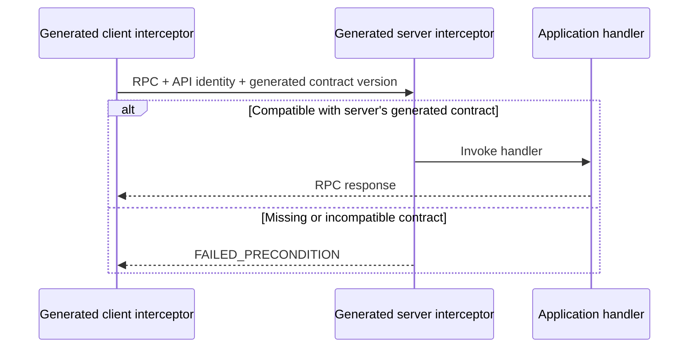

# Proto Contract

**Automatic semantic versioning and compatibility handshakes for protobuf APIs.**

Proto Contract calculates the version bump your schema change requires, generates that version into both client and server interceptors, and checks compatibility before application code runs. The tracked contract lock connects what you build to what your deployments accept. Application code never needs to repeat the API name or version.

Protobuf's wire format supports evolution. Proto Contract answers the deployment question: **can this client safely call this version of the service?**

## Automatic semantic versioning

The compiler compares a service and its reachable protobuf types with the tracked lock and calculates the minimum semantic version bump:

- **Additive schema change → minor bump**, such as adding a method or field.
- **Breaking schema change → major bump**, such as removing a method or changing a field's type.
- **No compared contract change → no bump.** Patch does not affect compatibility.

`check` detects drift and reports the required next version. After you review the change, `update` applies the calculated bump to the lock. `generate` then embeds that lock's identity and version into the client and server adapters. You choose the initial version once; subsequent schema-driven bumps are calculated automatically. Behavioral changes outside the schema can require an explicit higher bump. See the [classification policy](docs/COMPATIBILITY.md) for the exact scope and limits.

## A compatibility handshake on every supported RPC

The generated client declares its contract in request metadata. The generated server checks it against its own build's contract before invoking the handler: compatible requests proceed; incompatible requests receive `FAILED_PRECONDITION`.

This handshake travels with the RPC itself—there is no separate preflight request or version negotiation. Each deployment keeps the contract version it was built against.

For the same API identifier, acceptance requires:

```text
client.major == server.major && client.minor <= server.minor
```

For example, a client sends `x-proto-contract: demo.echo@1.0.0`. A server built at `1.0.0` accepts it, but rejects clients at `1.1.0` or `2.0.0`. Both sides get these values from generated code, not handwritten configuration.



**Python, Go, Java, .NET, and grpc-bridge TypeScript clients are supported.** With [grpc-bridge](https://github.com/dunkymole/grpc-bridge), independent generated clients can share one bridge connection while declaring their own contracts. The interoperability matrix covers all four RPC shapes; native strict server dispatch rejects unknown service registrations before application handlers run. See [runtime coverage](docs/RUNTIMES.md#rpc-coverage).

## Try the complete demo

You need Docker with Compose v2, Linux container support, and PowerShell to run the script below from the repository root. Builds download images and dependencies. The demonstration builds clients and servers in Python, Java, .NET, and Go, plus a TypeScript client using grpc-bridge. It exercises all five clients against all four servers: 20 combinations, each with accepted and rejected contract versions. Docker builds the bridge and its TypeScript package from a pinned source revision, so no local language toolchains are needed.

```powershell
./scripts/test-all.ps1
```

The script removes its Compose containers and network when finished. For individual runs or a shell-only workflow, see [running examples](docs/RUNTIMES.md#running-the-examples).

Expected result:

```text
PASS Python client -> Go server
PASS Go client -> Java server
PASS Java client -> .NET server
PASS .NET client -> Go server
PASS TypeScript grpc-bridge client -> Go server
All 20 client/server combinations passed (including TypeScript via grpc-bridge)
```

## Compiler workflow

Run these Bash examples from the repository root. See the [compiler reference](docs/COMPILER.md) for local installation, PowerShell equivalents, command options, and a build sequence.

Create the first lock when introducing an API (the demo lock is already tracked):

```bash
docker build -t proto-contract .
docker run --rm -v "$PWD:/workspace" -w /workspace proto-contract snapshot \
  --proto proto/demo/v1/echo.proto --proto-path proto \
  --service demo.v1.EchoService --api demo.echo --version 1.0.0 \
  --out contracts/demo.echo.json
```

Check that source and lock still agree:

```bash
docker run --rm -v "$PWD:/workspace" -w /workspace proto-contract check \
  --proto proto/demo/v1/echo.proto --proto-path proto \
  --service demo.v1.EchoService --lock contracts/demo.echo.json
```

`check` prints `unchanged` and exits successfully when the compared contract fields match. For a schema change, it exits nonzero and reports the minimum bump and required next version. After reviewing an intentional change, update the lock with the calculated minimum:

```bash
docker run --rm -v "$PWD:/workspace" -w /workspace proto-contract update \
  --proto proto/demo/v1/echo.proto --proto-path proto \
  --service demo.v1.EchoService --lock contracts/demo.echo.json
```

The compiler applies the calculated minimum automatically. You may pass `--bump minor` or `--bump major` to choose a higher bump when a semantic behavior change is invisible in descriptors. It refuses an explicit bump below the structural minimum. `version --lock contracts/demo.echo.json` prints only the version for build scripts.

Commit the reviewed lock, then generate each application's contract module from that lock as part of its build. `generate` does not inspect `.proto` files or update a lock: run `check` first. It is separate from the usual protobuf message/service code generator. Do not use `snapshot` to replace an existing lock when checking a change; that would discard the baseline used for comparison.

## Runtime adapters

Python, Go, Java, and .NET have service-scoped client interceptors and strict native server dispatchers that reject incompatible calls or unknown services before application logic runs, for all [four RPC shapes](docs/RUNTIMES.md#rpc-coverage).

**Generate both client and server contracts from their build's lock files.** Run `proto-contract check` against the proto, then `generate` alongside protobuf generation. Python, Go, Java, and .NET modules expose both client and server interceptors with no API or version arguments. Regenerate when that build's lock changes. Client and server builds may use different lock versions; neither should obtain its version from the other at runtime. Outputs use this repository's corresponding [runtime adapters](runtimes/); the TypeScript grpc-bridge client imports Connect directly. Keep each service's generated contract in its own module or package and register its matching interceptor.

The client and server snippets below represent separate applications, each using code generated from its own lock. All Docker example builds check the lock and generate their adapters before compilation.

The commands below assume `proto-contract` is installed on your `PATH`, or defined as the [Docker wrapper](docs/COMPILER.md#docker-wrapper). Code snippets show integration points, not complete applications; runnable clients and servers are under `examples/`.

### TypeScript / grpc-bridge

Generate a service-specific interceptor from the contract lock used to build your client. The API name, service name, and version are generated; application code does not repeat them:

```sh
proto-contract generate --lock contracts/demo.echo.json --lang typescript \
  --out src/gen/echo_contract.ts
```

Run this after the normal protobuf generation step (using the compiler binary or Docker image built above). Register the generated interceptor separately for each service client:

```typescript
import { createClient } from "@connectrpc/connect";
import { openBridgeConnection, interceptTransport } from "@dunkymole/grpc-bridge";
import { contractInterceptor } from "./gen/echo_contract.js";
import { EchoService } from "./gen/demo/v1/echo_pb.js";

const connection = await openBridgeConnection({
  url: "wss://bridge.example.com/tunnel",
  target: "echo-service:50051",
});
try {
  const client = createClient(
    EchoService,
    interceptTransport(connection.transport, {
      baseUrl: "http://echo-service:50051",
      interceptors: [contractInterceptor],
    }),
  );
  const reply = await client.echo({ text: "hello" }, { timeoutMs: 5000 });
  console.log(reply.text);
} finally {
  await connection.close();
}
```

This also works with `createBridgeConnection` and transports acquired from `createSharedBridgeConnection`. Each wrapper belongs to its service client; it leaves the shared transport unchanged. The bridge forwards the contract metadata to the native gRPC server, which enforces compatibility. See the [runnable grpc-bridge example](examples/clients/grpc-bridge/README.md) and [runtime details](docs/RUNTIMES.md#typescript--grpc-bridge-client).

Regenerate when the client's contract lock changes. The generated module embeds that build's contract version; it must not read a deployed server's current version at runtime. Explicit versions in the interoperability tests are test fixtures for compatible and incompatible clients.

### Python

```sh
proto-contract generate --lock contracts/demo.echo.json --lang python --out echo_contract.py
```

Make `runtimes/python/proto_contract.py` importable alongside the generated module:

```python
from concurrent import futures
import grpc
from echo_contract import ClientInterceptor, StrictServerInterceptor

# Client: use this channel when constructing generated stubs.
channel = grpc.intercept_channel(grpc.insecure_channel("localhost:50051"), ClientInterceptor())

# Server: install strict dispatch globally. Unknown registered services fail closed.
server = grpc.server(
    futures.ThreadPoolExecutor(),
    interceptors=(StrictServerInterceptor(),),
)
```

### Go

```sh
proto-contract generate --lock contracts/demo.echo.json --lang go --package echocontract \
  --out gen/go/contracts/echo/contract.go
```

```go
import (
    "log"

    echocontract "github.com/dunkymole/proto-contract/gen/go/contracts/echo"
    pb "github.com/dunkymole/proto-contract/gen/go/demo/v1"
    "google.golang.org/grpc"
    "google.golang.org/grpc/credentials/insecure"
)

// Client: construct generated clients from conn.
conn, err := grpc.NewClient(
    "localhost:50051",
    grpc.WithTransportCredentials(insecure.NewCredentials()),
    grpc.WithUnaryInterceptor(echocontract.ClientInterceptor()),
    grpc.WithStreamInterceptor(echocontract.ClientStreamInterceptor()),
)
if err != nil {
    log.Fatal(err)
}

// Server: strict dispatch must run globally and cover unary plus streams.
strict, err := echocontract.StrictServer()
if err != nil { log.Fatal(err) }
server := grpc.NewServer(
    grpc.ChainUnaryInterceptor(strict.Unary()),
    grpc.ChainStreamInterceptor(strict.Stream()),
)
pb.RegisterEchoServiceServer(server, implementation)
if err := strict.ValidateRegisteredServices(server); err != nil { log.Fatal(err) }
```

In your own module, change the `echocontract` import to your generated package's path. The generated file still imports the reusable Proto Contract runtime.

### Java

```sh
proto-contract generate --lock contracts/demo.echo.json --lang java \
  --package protocontract.generated.echo --out src/main/java/protocontract/generated/echo/Contract.java
```

Compile the generated `Contract.java` with the Java runtime adapter sources:

```java
import io.grpc.ManagedChannel;
import io.grpc.ManagedChannelBuilder;
import io.grpc.ServerBuilder;
import protocontract.generated.echo.Contract;

// Client: construct the generated stub from this channel.
ManagedChannel channel = ManagedChannelBuilder.forAddress("localhost", 50051)
    .usePlaintext()
    .intercept(Contract.clientInterceptor())
    .build();

// Server: install one strict dispatcher globally; do not wrap only selected services.
io.grpc.Server server = ServerBuilder.forPort(50051)
    .addService(new EchoServiceImpl())
    .intercept(Contract.strictServerInterceptor())
    .build();
```

### .NET

```sh
proto-contract generate --lock contracts/demo.echo.json --lang dotnet \
  --package ProtoContract.Generated.Echo --out Generated/Contract.cs
```

Include the generated source and both interceptor sources from `runtimes/dotnet` in your project:

```csharp
using Grpc.Core.Interceptors;
using Grpc.Net.Client;
using EchoContract = ProtoContract.Generated.Echo.Contract;

// Client: construct the generated client from this invoker.
using var channel = GrpcChannel.ForAddress("https://api.example.com");
var invoker = channel.Intercept(EchoContract.ClientInterceptor());

// ASP.NET Core server: install fail-closed dispatch globally for every mapped service.
builder.Services.AddSingleton(EchoContract.StrictServerInterceptor());
builder.Services.AddGrpc(options => options.Interceptors.Add<ProtoContract.StrictServerInterceptor>());
```

The demo source contains complete runnable services and clients. See [runtime integration](docs/RUNTIMES.md) for behavior and dependency details.

## Repository layout

```text
cmd/proto-contract/  compiler CLI
internal/contract/   schema snapshots, compatibility classifier, code generation
contracts/           tracked contract locks
proto/               example protobuf API
gen/                 checked-in Go protobuf bindings and generated demo contract
runtimes/<language>/  reusable client and server interceptors
examples/clients/     native clients and the TypeScript grpc-bridge client
examples/servers/     runnable servers, one directory per language
scripts/              build and interoperability checks
```

## What gets versioned

The lock contains the selected service, its methods, and messages and enums reachable from request and response types. It excludes unrelated declarations. The current classifier treats additions as minor and removals or changes as major. The exact policy and current limits are in [compatibility policy](docs/COMPATIBILITY.md).

Proto Contract is independent of application release versions and authentication. The metadata is a compatibility assertion, not a credential.

## Project status

This is a working early prototype. The lock format is versioned but has not reached a stability guarantee. The roadmap includes published language packages and CI integrations.

## Contributing and security

Contributions are welcome. Read [CONTRIBUTING.md](CONTRIBUTING.md) before opening a pull request. Report security concerns according to [SECURITY.md](SECURITY.md).

Licensed under the [MIT License](LICENSE).
