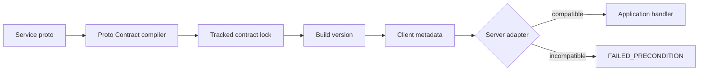

# Proto Contract

Proto Contract gives protobuf APIs an explicit, enforceable compatibility version. It compiles a service and its reachable type graph into a deterministic lock file, calculates the minimum semantic version bump after a schema change, and supplies small gRPC runtime adapters for Python, Java, .NET, Go, and TypeScript clients using [grpc-bridge](https://github.com/dunkymole/grpc-bridge).

**grpc-bridge is supported:** bind a TypeScript contract to each generated service client to enforce compatibility from browsers or Node.js against any of the four server runtimes. Clients with independent contracts can share one bridge connection. The complete demo tests the real WebSocket bridge in its interoperability matrix.

The rule is intentionally simple:

```text
client.major == server.major && client.minor <= server.minor
```

Patch releases do not change schema compatibility. A client sends `x-proto-contract: demo.echo@1.0.0` on every RPC. A server at `1.1.0` accepts it, but rejects clients at `1.2.0` or `2.0.0` with `FAILED_PRECONDITION`.

## Why

Protobuf's wire format is designed for evolution, but an application often needs a clear answer to a different question: *can this deployed client safely call this deployed service?* Package versions and release versions do not answer that reliably. Proto Contract derives a separate version from the public protobuf graph and makes that version available at runtime.



## Try the complete demo

You need Docker with Compose. The demonstration builds clients and servers in Python, Java, .NET, and Go, plus a TypeScript client using grpc-bridge. It exercises all five clients against all four servers: 20 combinations, each with accepted and rejected contract versions. Docker builds the bridge and its TypeScript package from a pinned source revision, so no published npm release or local Node.js installation is required.

```powershell
./scripts/test-all.ps1
```

Expected result:

```text
PASS Python client -> Go server
PASS Go client -> Java server
PASS Java client -> .NET server
PASS .NET client -> Go server
PASS TypeScript grpc-bridge client -> Go server
All 20 client/server combinations passed (including TypeScript via grpc-bridge)
```

## Compiler workflow

Create the first lock:

```bash
docker build -t proto-contract .
docker run --rm -v "$PWD:/workspace" -w /workspace proto-contract snapshot \
  --proto proto/demo/v1/echo.proto --proto-path proto \
  --service demo.v1.EchoService --api demo.echo --version 1.1.0 \
  --out contracts/demo.echo.json
```

Check that source and lock still agree:

```bash
docker run --rm -v "$PWD:/workspace" -w /workspace proto-contract check \
  --proto proto/demo/v1/echo.proto --proto-path proto \
  --service demo.v1.EchoService --lock contracts/demo.echo.json
```

When the schema changes, `check` reports `none`, `minor`, or `major` and the required next version. Update the lock with the calculated minimum:

```bash
docker run --rm -v "$PWD:/workspace" -w /workspace proto-contract update \
  --proto proto/demo/v1/echo.proto --proto-path proto \
  --service demo.v1.EchoService --lock contracts/demo.echo.json
```

The compiler applies the calculated minimum automatically. You may pass `--bump minor` or `--bump major` to choose a higher bump when a semantic behavior change is invisible in descriptors. It refuses an explicit bump below the structural minimum. `version --lock contracts/demo.echo.json` prints only the version for build scripts.

## Runtime adapters

Python, Go, Java, and .NET have client interceptors that attach the contract to every call and native server interceptors that reject incompatible calls before application logic runs.

**Generate every client's contract from its lock file.** Run `proto-contract check` against the client's proto, then `generate` alongside protobuf generation. Each generated module exposes a no-argument interceptor bound to that lock's API and version. Regenerate when the client lock changes; do not substitute the deployed server's current version. Python, Go, Java, and .NET outputs use this repository's corresponding [runtime adapter](runtimes/); TypeScript output imports Connect directly. Keep each generated contract in its own module or package when a client uses multiple services.

### TypeScript / grpc-bridge

Generate a service-specific interceptor from the contract lock used to build your client. The API name, service name, and version are generated; application code does not repeat them:

```sh
proto-contract generate --lock contracts/demo.echo.json --lang typescript \
  --out src/gen/echo_contract.ts
```

Run this after the normal protobuf generation step (using the compiler binary or Docker image built above). Register the generated interceptor separately for each service client:

```typescript
import { createClient } from "@connectrpc/connect";
import { openBridgeConnection, interceptTransport } from "@dunkymole/grpc-bridge";
import { contractInterceptor } from "./gen/echo_contract.js";
import { EchoService } from "./gen/demo/v1/echo_pb.js";

const connection = await openBridgeConnection({
  url: "wss://bridge.example.com/tunnel",
  target: "echo-service:50051",
});
try {
  const client = createClient(
    EchoService,
    interceptTransport(connection.transport, {
      baseUrl: "http://echo-service:50051",
      interceptors: [contractInterceptor],
    }),
  );
  const reply = await client.echo({ text: "hello" }, { timeoutMs: 5000 });
  console.log(reply.text);
} finally {
  await connection.close();
}
```

This also works with `createBridgeConnection` and transports acquired from `createSharedBridgeConnection`. Each wrapper belongs to its service client; it leaves the shared transport unchanged. The bridge forwards the contract metadata to the native gRPC server, which enforces compatibility. See the [runnable grpc-bridge example](examples/clients/grpc-bridge/README.md) and [runtime details](docs/RUNTIMES.md#typescript--grpc-bridge-client).

Regenerate when the client's contract lock changes. The generated module embeds that build's contract version; it must not read a deployed server's current version at runtime. Explicit versions in the interoperability tests are test fixtures for compatible and incompatible clients.

### Python

```sh
proto-contract generate --lock contracts/demo.echo.json --lang python --out echo_contract.py
```

Make `runtimes/python/proto_contract.py` importable alongside the generated module:

```python
from concurrent import futures
import grpc
from proto_contract import ContractServerInterceptor
from echo_contract import ClientInterceptor

# Client: use this channel when constructing generated stubs.
channel = grpc.intercept_channel(grpc.insecure_channel("localhost:50051"), ClientInterceptor())

# Server: the interceptor runs before the generated service handler.
server = grpc.server(
    futures.ThreadPoolExecutor(),
    interceptors=(ContractServerInterceptor("demo.echo", "1.1.0"),),
)
```

### Go

```sh
proto-contract generate --lock contracts/demo.echo.json --lang go --package echocontract \
  --out gen/go/contracts/echo/contract.go
```

```go
import (
    "log"

    contract "github.com/dunkymole/proto-contract/runtimes/go/protocontract"
    echocontract "github.com/dunkymole/proto-contract/gen/go/contracts/echo"
    "google.golang.org/grpc"
    "google.golang.org/grpc/credentials/insecure"
)

// Client: construct generated clients from conn.
conn, err := grpc.NewClient(
    "localhost:50051",
    grpc.WithTransportCredentials(insecure.NewCredentials()),
    grpc.WithUnaryInterceptor(echocontract.ClientInterceptor()),
)
if err != nil {
    log.Fatal(err)
}

// Server: register generated services on server.
server := grpc.NewServer(
    grpc.UnaryInterceptor(contract.UnaryServer("demo.echo", "1.1.0")),
)
```

### Java

```sh
proto-contract generate --lock contracts/demo.echo.json --lang java \
  --package protocontract.generated.echo --out src/main/java/protocontract/generated/echo/Contract.java
```

Compile the generated `Contract.java` with the Java runtime adapter sources:

```java
import io.grpc.ManagedChannel;
import io.grpc.ManagedChannelBuilder;
import io.grpc.ServerBuilder;
import io.grpc.ServerInterceptors;
import protocontract.generated.echo.Contract;
import io.github.dunkymole.protocontract.ContractServerInterceptor;

// Client: construct the generated stub from this channel.
ManagedChannel channel = ManagedChannelBuilder.forAddress("localhost", 50051)
    .usePlaintext()
    .intercept(Contract.clientInterceptor())
    .build();

// Server: EchoServiceImpl is the generated service implementation.
io.grpc.Server server = ServerBuilder.forPort(50051)
    .addService(ServerInterceptors.intercept(
        new EchoServiceImpl(),
        new ContractServerInterceptor("demo.echo", "1.1.0")))
    .build();
```

### .NET

```sh
proto-contract generate --lock contracts/demo.echo.json --lang dotnet \
  --package ProtoContract.Generated.Echo --out Generated/Contract.cs
```

Include the generated source and `runtimes/dotnet/ContractClientInterceptor.cs` in your project:

```csharp
using Grpc.Core.Interceptors;
using Grpc.Net.Client;
using ProtoContract;
using EchoContract = ProtoContract.Generated.Echo.Contract;

// Client: construct the generated client from this invoker.
using var channel = GrpcChannel.ForAddress("https://api.example.com");
var invoker = channel.Intercept(EchoContract.ClientInterceptor());

// ASP.NET Core server registration.
builder.Services.AddSingleton(
    new ContractServerInterceptor("demo.echo", "1.1.0"));
builder.Services.AddGrpc(options =>
    options.Interceptors.Add<ContractServerInterceptor>());
```

The demo source contains complete runnable services and clients. See [runtime integration](docs/RUNTIMES.md) for behavior and dependency details.

## Repository layout

```text
compiler/            schema snapshot and compatibility classifier
contracts/           tracked contract locks
proto/               example protobuf API
gen/                  shared checked-in generated bindings
runtimes/<language>/  reusable client and server interceptors
examples/clients/     runnable clients, one directory per language
examples/servers/     runnable servers, one directory per language
scripts/              build and interoperability checks
```

## What gets versioned

The lock contains the selected service, its methods, and messages and enums reachable from request and response types. It excludes unrelated declarations. The current classifier treats additions as minor and removals or changes as major. The exact policy and current limits are in [compatibility policy](docs/COMPATIBILITY.md).

Proto Contract is independent of application release versions and authentication. The metadata is a compatibility assertion, not a credential.

## Project status

This is a working early prototype. The lock format is versioned but has not reached a stability guarantee. The immediate roadmap is richer protobuf compatibility classification, all four streaming shapes, generated server integration, published language packages, and CI integrations.

## Contributing and security

Contributions are welcome. Read [CONTRIBUTING.md](CONTRIBUTING.md) before opening a pull request. Report security concerns according to [SECURITY.md](SECURITY.md).

Licensed under the [MIT License](LICENSE).
