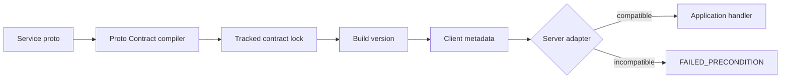

# Proto Contract

Proto Contract gives protobuf APIs an explicit, enforceable compatibility version. It compiles a service and its reachable type graph into a deterministic lock file, calculates the minimum semantic version bump after a schema change, and supplies small gRPC runtime adapters that reject incompatible clients before application logic runs.

The rule is intentionally simple:

```text
client.major == server.major && client.minor <= server.minor
```

Patch releases do not change schema compatibility. A client sends `x-proto-contract: demo.echo@1.0.0` on every RPC. A server at `1.1.0` accepts it, but rejects clients at `1.2.0` or `2.0.0` with `FAILED_PRECONDITION`.

## Why

Protobuf's wire format is designed for evolution, but an application often needs a clear answer to a different question: *can this deployed client safely call this deployed service?* Package versions and release versions do not answer that reliably. Proto Contract derives a separate version from the public protobuf graph and makes that version available at runtime.



## Try the complete demo

You need Docker with Compose. The demonstration builds one Python client and servers in C++, Java, .NET, and Go, then exercises accepted and rejected versions against every server.

```powershell
./scripts/test-all.ps1
```

Expected result:

```text
PASS Go: accepted 1.0.0; rejected 1.2.0 and 2.0.0
PASS C++: accepted 1.0.0; rejected 1.2.0 and 2.0.0
PASS Java: accepted 1.0.0; rejected 1.2.0 and 2.0.0
PASS .NET: accepted 1.0.0; rejected 1.2.0 and 2.0.0
All contract checks passed
```

## Compiler workflow

Create the first lock:

```bash
docker build -t proto-contract .
docker run --rm -v "$PWD:/workspace" -w /workspace proto-contract snapshot \
  --proto proto/demo/v1/echo.proto --proto-path proto \
  --service demo.v1.EchoService --api demo.echo --version 1.1.0 \
  --out contracts/demo.echo.json
```

Check that source and lock still agree:

```bash
docker run --rm -v "$PWD:/workspace" -w /workspace proto-contract check \
  --proto proto/demo/v1/echo.proto --proto-path proto \
  --service demo.v1.EchoService --lock contracts/demo.echo.json
```

When the schema changes, `check` reports `none`, `minor`, or `major` and the required next version. Update the lock with the calculated minimum:

```bash
docker run --rm -v "$PWD:/workspace" -w /workspace proto-contract update \
  --proto proto/demo/v1/echo.proto --proto-path proto \
  --service demo.v1.EchoService --lock contracts/demo.echo.json
```

The compiler applies the calculated minimum automatically. You may pass `--bump minor` or `--bump major` to choose a higher bump when a semantic behavior change is invisible in descriptors. It refuses an explicit bump below the structural minimum. `version --lock contracts/demo.echo.json` prints only the version for build scripts.

## Runtime adapters

The Python client uses [`ContractClientInterceptor`](runtimes/python/proto_contract.py). Go, Java, and .NET use native server interceptors. gRPC C++ server interceptors cannot terminate an RPC safely at metadata receipt, so the C++ adapter is a small verifier called at the start of a handler. See [runtime integration](docs/RUNTIMES.md) for copyable examples.

## What gets versioned

The lock contains the selected service, its methods, and messages and enums reachable from request and response types. It excludes unrelated declarations. The current classifier treats additions as minor and removals or changes as major. The exact policy and current limits are in [compatibility policy](docs/COMPATIBILITY.md).

Proto Contract is independent of application release versions and authentication. The metadata is a compatibility assertion, not a credential.

## Project status

This is a working early prototype. The lock format is versioned but has not reached a stability guarantee. The immediate roadmap is richer protobuf compatibility classification, all four streaming shapes, generated adapters, published language packages, and CI integrations.

## Contributing and security

Contributions are welcome. Read [CONTRIBUTING.md](CONTRIBUTING.md) before opening a pull request. Report security concerns according to [SECURITY.md](SECURITY.md).

Licensed under the [MIT License](LICENSE).
